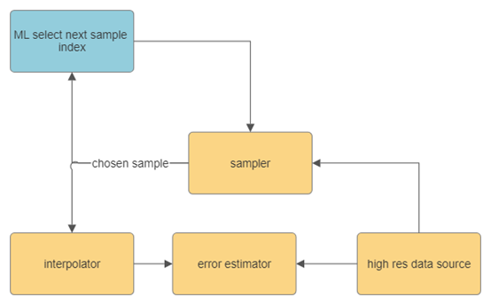
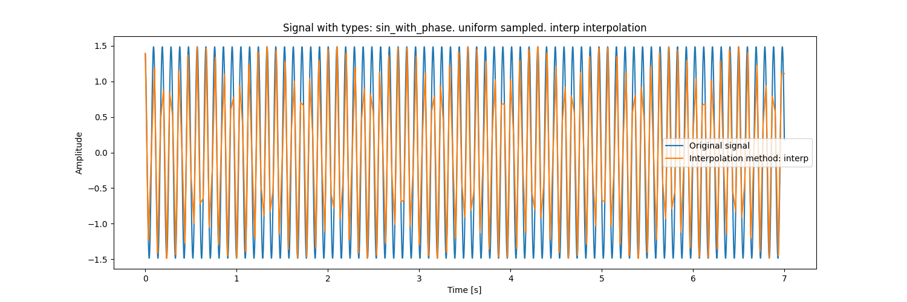
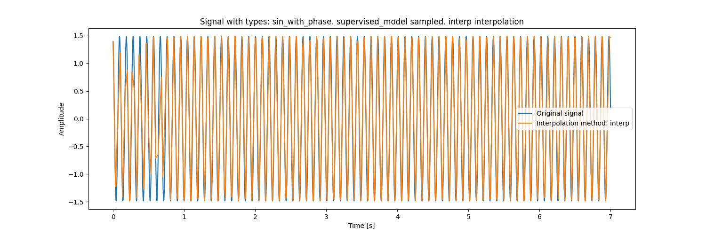
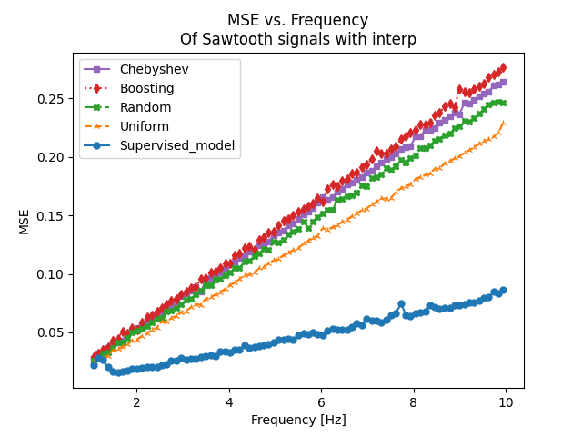
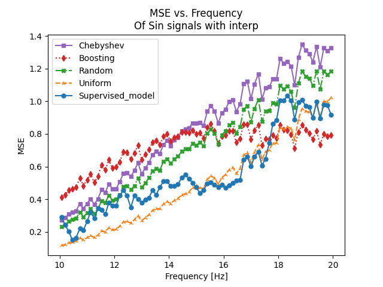
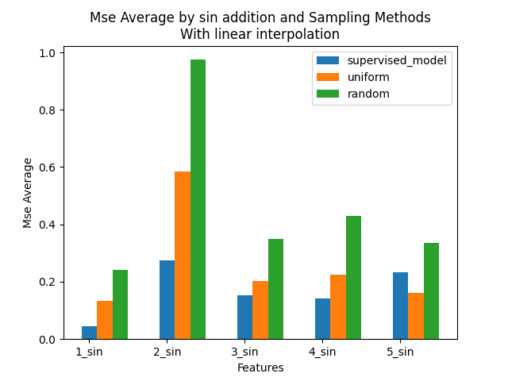
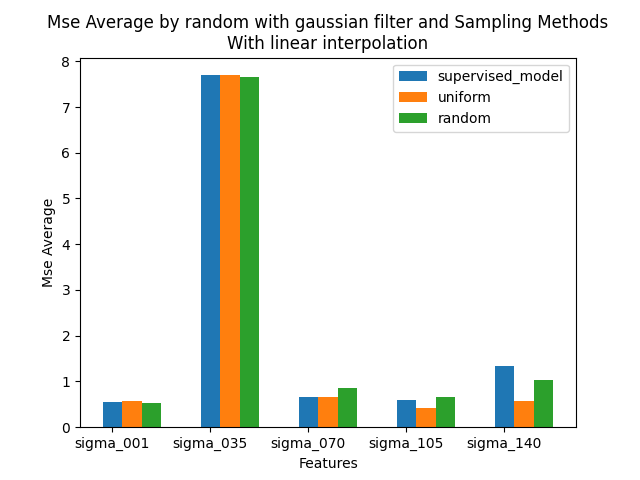
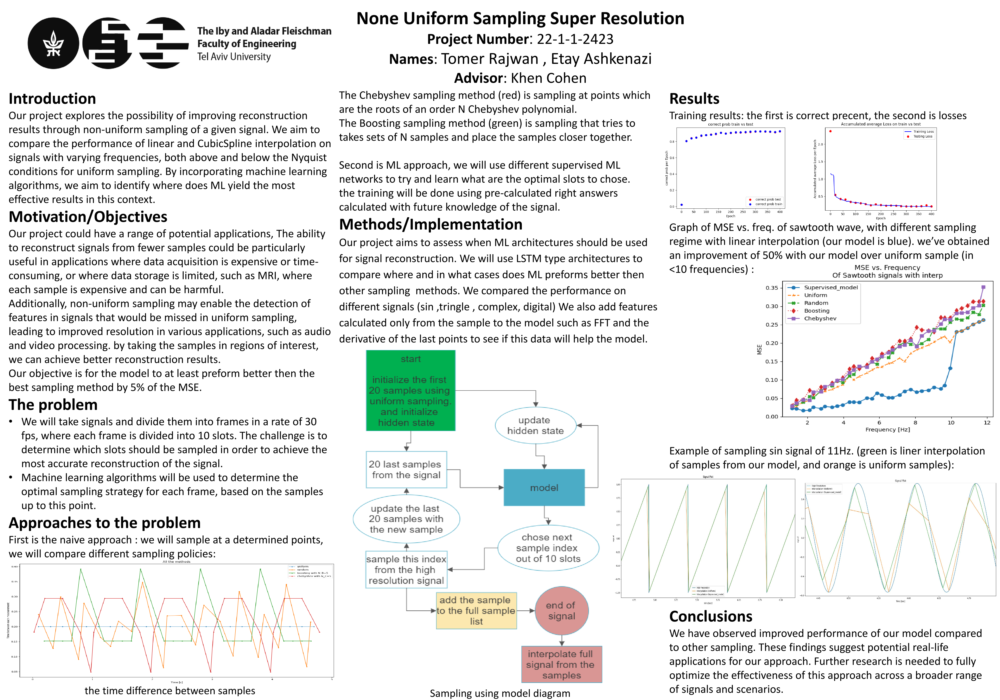

# Non-Uniform Sampling Super Temporal Resolution (NUSTSR)

## Abstract
In this project, we explore the use of non-uniform sampling methods for improving signal
reconstruction. To do that we incorporate machine learning algorithms to identify the contexts
where ML preforms better compared to other sampling methods.

We will look at cases where we don’t attain Nyquist minimal sampling frequency and try to
find the optimal sampling points. The algorithm will work iteratively, by choosing a sampling
point based only on values sampled prior to that point (causality), one point at a time. We will
assume limited memory, both in the ML, and in the interpolator.

Recurrent neural networks (RNN), such as LSTM and GRU, have had outstanding success in
sequential modelling, and have been applied in many application fields, including signal
processing. These models have become an obvious choice for time series modelling and a
promising tool for handling irregular time series data.



## Outputs
From this repo we can produce three types of results that will show the performance of the created model.

### The Interpolated Sampled Signal
We can get a plot of the interpolated signal based on the variety of the sampling methods.

Examples:



### Sweep  
We can get a sweep plot of the performance of different sampling methods on frequencies of created signals.

Examples:  



### Feature Based  
We can also plot bar chart where we compere different sampling methods based on some features of the signal, For example: the number of sine waves in a signal that's the sum of them.

Examples:   



## How To Run
**For our project, we developed and evaluated the code on a Ubuntu 18.04.5 LTS Linux server, utilizing a CUDA GPU.**

To run our project, like the block diagram explain,
first you need to open: Data_Base/Data Saver.py   and set these variables with the parameters of the database we want to create:
```python
interpolation_method = 'CubicSpline'  # interp , CubicSpline 
database_name = '_both_freq_sin_with_phase_1-10' 
simulation_time = 7
factor = 2
fps = 30
number_of_slots = 10
freqs = (1, 10)
all_type_list = ['sin_with_phase']
num_of_funcs_to_save = 400
```
and run this code to create the database.

After that you need to open: supervised/model_run.py  and set these variables with the parameters related the model we want to create,
Here we can select which features to send to the model (FFT, derivative, both or none), we can choose the range of signal from the database to train and test on, we can choose the architecture and its shape and we can choose the loos function and the learning rate function  (linear combination of them):
```python
parameters = {
    'PATH': 'models',
    'MODEL_NAME': 'cubic_osci_chirp',
    'data_path': 'Data_Base_CubicSpline_both_freq_oscillating_chirp_with_phase_1-10.npy',
    'start_from_func': 0,
    'end_in_func': -1,  # -1 for all function in the data_path

    'fps': 30,
    'number_of_slots': 10,
    'simulation_time': 7,

    'state_sample_length': 20,
    'output_size': 10,  # same as number of slots
    'batch_size': 20,
    'seq_length': 7,
    'feature_dict': {'derivative': 1, 'FFT': 0},

    'hidden_dim': 70,
    'n_layers': 6,
    'architecture': {'RNN': 0, 'GRU': 0, 'LSTM': 1, 'TGLSTM': 0},
    # only one should be on, if not the first one would be chosen
    'extra_to_model': {'dropout': 0.3, 'encoder_channels': 0, 'decoder_channels': 0, 'hidden': 'rand_gauss'},
    # the dropout value is the drop_prob
    #  rand_gauss ,   rand_unif ,   zeros
    'n_epochs': 0,
    'lr_start': 0.0005,
    'evaluation_interval': 20,
    'gamma': 280,
    'lr_func': {'step_decay': 0, 'cosine_annealing': 0, 'poly_decay': 0, 'exp_decay': 0, 'exp_log_decay': 0,
                'linear_decay': 1},  # the linear is more like a log 
    'loss_funcs': {'CrossEntropyLoss': 1, 'L1_loss_on_weghits': 0.8, 'L2_loss_on_weghits': 0, 'L1Loss': 0.1, 'MSELoss': 0}
}
```
Also, choose the databases to train on and compare their model performances:
```python
PATHs = ['Data_Base_interp_sin_with_phase_1-10.npy',
   'Data_Base_interp_sin_with_phase_10-20.npy']
```
After that run this file.

At last, to compare the results of the model to other sampling methods.
Here we have two ways visualizing the data the first is a sweep based (e.g. the frequency of the signal Vs. the MSE) or feature based (e.g. the amount of added sines signal Vs. MAE).

```python
func_type = 'sawtooth_with_phase'
sampling_methods = ["supervised_model", "uniform", "random", "boosting", "chebyshev"]
interpolation_method = "interp"  # interp, CubicSpline 

supervised_parameters = {
    'model_path_low_freq' : 'supervised/models/…/',
    'model_path_high_freq': 'supervised/models/…/',
    ...
}
num_repetitions = 2  # for averaging
signals_count = 12

error_type = "Max_error"  # Max_error ,  MSE ,  L1_error
```
and run.


## Project Poster


